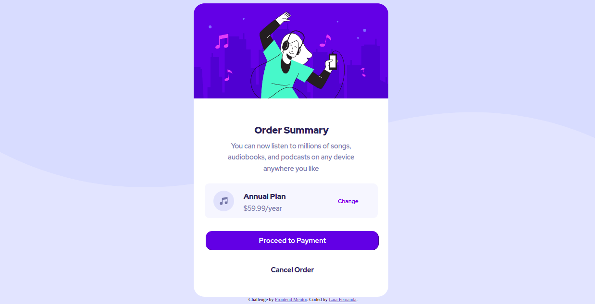

# Order-Summary



# Como executar

Clone o projeto em seu dispositivo e acesse a pasta do mesmo
```
$ git clone https://github.com/Lara123-pg/Order-Summary.git
$ cd Order-Summary
$ code .  (Abrir o Visual Studio Code)
```
Logo em seguida, o projeto estará em seu editor para ser executado.

# Projeto

Order Summary é um componente de cartão de pedido que está relacionado a músicas.


